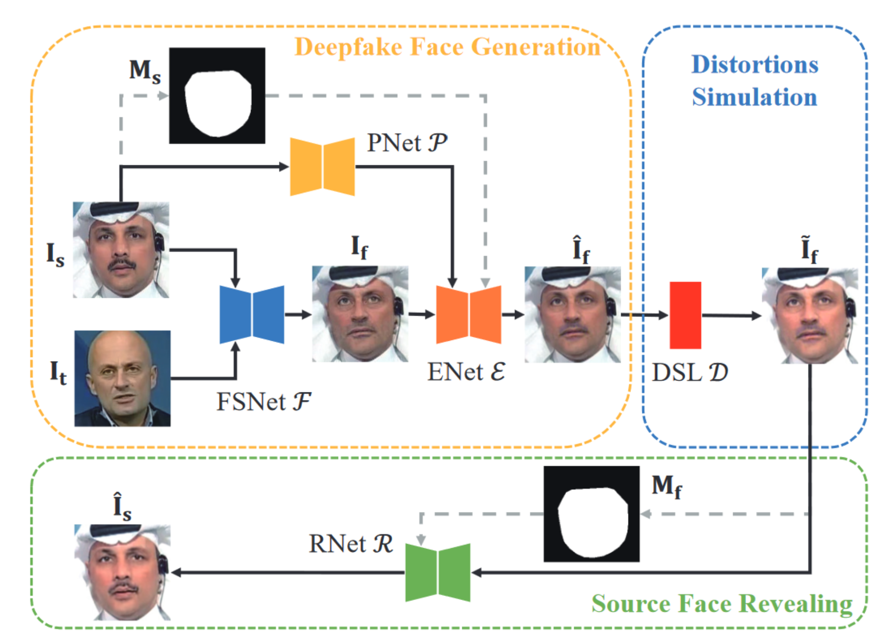

# Source-ID-Tracker

 

Source ID Tracker: Source Face Identity Protection in Face Swapping
in *IEEE International Conference on Multimedia and Expo (ICME)*, 2022.

## Pipeline
### Preprocessing
Extracting face images with MTCNN:
``` python
python ext_ff.py
```

Generating face landmarks with dlib:
``` python
python save_dlib_mask/generate_landmarks_dlib_ff_df_save_img.py
```

Splitting the dataset and getting the txt:
``` python
python get_txt.py
```


### Training
Training the Source-ID-Tracker model:
``` python
python train.py
```

### Inference
1. Revealing source images from fake images
``` python
python generate_test_images.py
python calculate_id_sim.py
python calculate_metric.py
python calculate_id_sim_perturbation.py

```
2. Revealing source images from fake images of simulated distortions
``` python
python generate_test_images.py
python generate_perturbation.py
python Revealed_perturbation.py 
python calculate_id_sim_perturbation.py

```


## Reference

```
@inproceedings{lin2022source,
  title = {Source-{{ID-Tracker}}: {{Source Face Identity Protection}} in {{Face Swapping}}},
  shorttitle = {Source-{{ID-Tracker}}},
  booktitle = {2022 {{IEEE International Conference}} on {{Multimedia}} and {{Expo}} ({{ICME}})},
  author = {Lin, Yuzhen and Chen, Han and Maiorana, Emanuele and Campisi, Patrizio and Li, Bin},
  year = {2022},
  pages = {01--06},
  issn = {1945-788X}
}
```